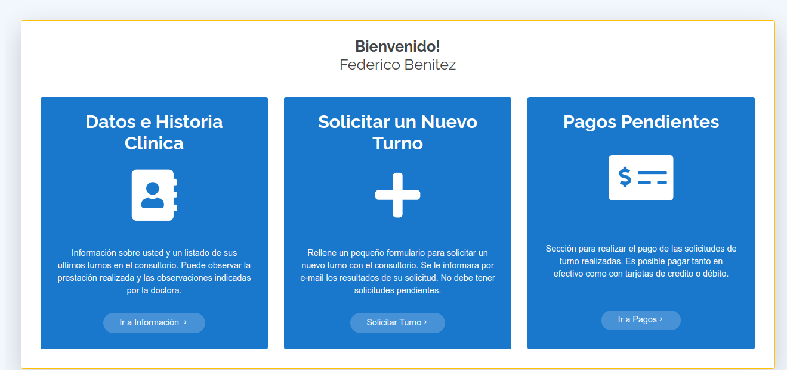

# Página Dentista TP Integrador Parte 2

Parte del login y gestión de los turnos con manejo de base de datos para la pagina web de la dentista

# Screenshots




### Pre-requisitos 📋

```
NodeJS
```

```
Mysql
```

### Instalación 🔧

Ejecutar el siguiente comando por terminal en la carpeta raiz del repositorio

```
npm i

```

Y luego:

```
npm i nodemon -D
```

Y para ejecutar corremos el siguiente comando

```
npm run dev
```
