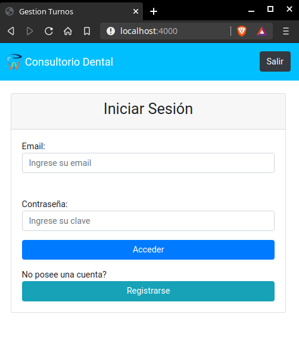
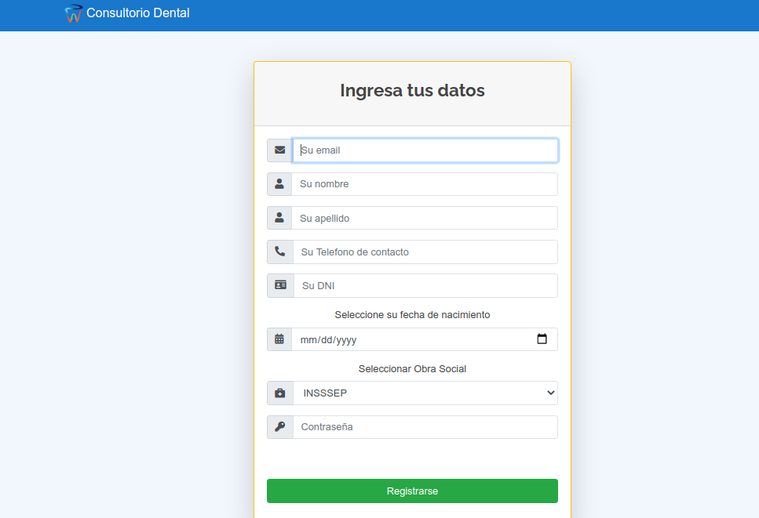

# Página Dentista TP Integrador Parte 2

Parte del login y gestión de los turnos con manejo de base de datos para la pagina web de la dentista

# Screenshots




### Pre-requisitos 📋

```
NodeJS
```

```
Mysql
```

### Instalación 🔧

Ejecutar el siguiente comando por terminal en la carpeta raiz del repositorio

```
npm i express express-handlebars express-session mysql express-mysql-session morgan bcrypt.js passport passport-local timeago.js connect-flash express-validator

```

Y luego:

```
npm i nodemon -D
```

Por ultimo, importamos la base de datos que se encuentra en la carpeta `./database` a nuestra base de datos, previamente tenemos que crear una base de datos en MySQL que se llame `pacientes`

Y para ejecutar corremos el siguiente comando

```
npm run dev
```
